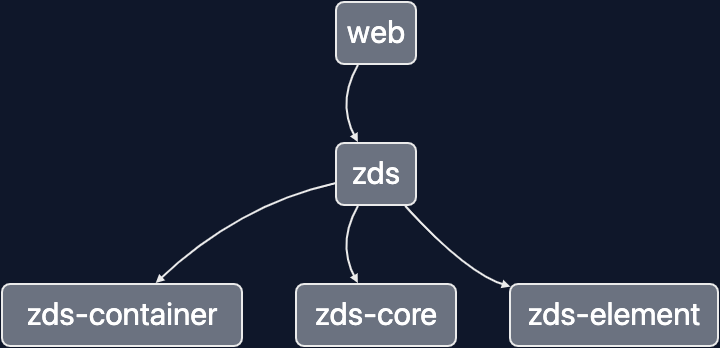

# Zds

지그재그 디자인 시스템

## 구조
다음과 같은 구조를 가집니다.
* zds: 다른 zds 패키지를 한 곳에서 내보내는 역활, 실제로 다른 곳에서 사용되는 패키지, 전체적인 문서는 여기서 작업
* zds-core: style-token(text, color, theme)
* zds-element: [100_element](https://www.figma.com/file/qdogFNN3Z0DCXFtejgtHDH/ZDS-2.0.0?node-id=344%3A12261)를 구현
* zds-container: [200_container](https://www.figma.com/file/qdogFNN3Z0DCXFtejgtHDH/ZDS-2.0.0?node-id=344%3A12256)를 구현

## 해당 구조를 잡은 이유
### 해당 수정한 부분만 빌드하기 위해서(빌드속도 최적화)
해당 수정한 패키지만 수정를 하기 위해서, 수정한 패키지만 테스트 후 빌드하면 됨
예를 들어, `zds-container`만 수정하면 해당 패키지만 빌드하기 위함

### 영향도를 파악하기 위해서
패키지가 나눠져 있어야 패키지끼리 영향을 미치는지 파악하기 쉽다.
core가 변경하면 `zds-core` -> `zds-element` -> `zds-container`로 영향을 주니, 모든 패키지가 테스트하고 빌드되어야 한다.
예를 들어 `core`에서 `color` 값을 변경한다면 `element`의 `Button`도 변경이 되고 `container`의 `ButtonNavigation`도 변경되어야 하니깐 모두 빌드 된다.

> 다만, 모든 컴포넌트를 각 패키지로 만들어도 좋을 수도 있지만, 그 정도로 의존성 파악이 필요한지 모르겠고, 만약 너무 커진다면 나누는것은 좋은 생각일 것 같다. 



## 테스트해보기
* [web/src/app.tsx](packages/web/src/app/app.tsx)에서 테스트를 해볼 수 있다.
```tsx
import { Zds, ZdsCore, ZdsContainer, ZdsElement } from '@croquiscom/zds';
import styled from '@emotion/styled';

const StyledApp = styled.div``;

export function App() {
  return (
    <StyledApp>
      <Zds />
      <ZdsCore />
      <ZdsElement />
      <ZdsContainer />
    </StyledApp>
  );
}

export default App;

```

* zds 패키지는 `ZdsCore`, `ZdsContainer`, `ZdsElement`를 가져다 사용할 수 있다.

